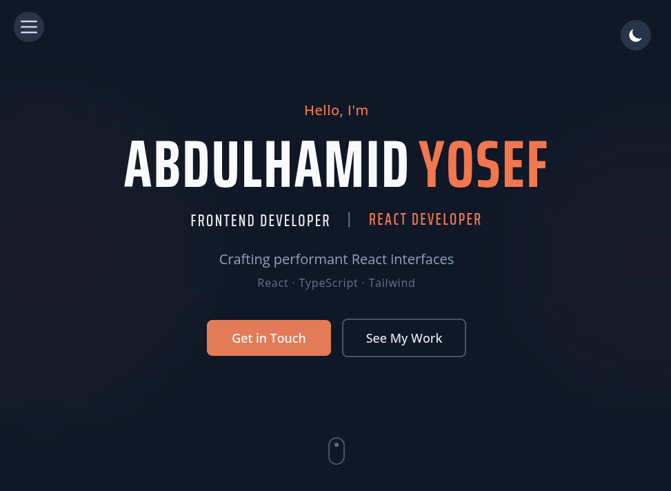

<div align="center">

# 👨‍💻 Abdulhamid Yosef

### React Developer Portfolio

[](https://react.dev/)
[](https://www.typescriptlang.org/)
[](https://tailwindcss.com/)
[](https://vitejs.dev/)

A modern, responsive portfolio website showcasing my experience and skills.

[**🌐 View Live Demo**](https://abdelhamid99.netlify.app/)

</div>

---

## 📸 Preview

<div align="center">
  <a href="https://abdelhamid99.netlify.app/">
    
  </a>
  <p><em>Click to view live demo</em></p>
</div>

## 🛠️ Built With

<div align="center">


</div>

## ✨ Features

| Feature                  | Description                                   |
| ------------------------ | --------------------------------------------- |
| 🎨 **Modern Design**     | Clean, professional UI with smooth animations |
| 🌙 **Dark/Light Mode**   | Theme toggle with system preference detection |
| 📱 **Fully Responsive**  | Looks great on all devices                    |
| ⚡ **Fast Performance**  | Built with Vite for lightning-fast loading    |
| 🎭 **Scroll Animations** | Elements animate as they enter viewport       |
| 🃏 **Project Cards**     | Expandable cards with live demo links         |
| 📬 **Contact Form**      | Working form with Formspree integration       |
| 🔍 **SEO Optimized**     | Meta tags and OpenGraph support               |

## 🚀 Quick Start

```bash
# Clone the repository
git clone https://github.com/yourusername/portfolio.git

# Navigate to project
cd portfolio

# Install dependencies
npm install

# Start development server
npm run dev
```

Open [http://localhost:5173](http://localhost:5173) to view it in your browser.

## 📁 Project Structure

```
src/
├── 📂 assets/          # Images and static files
├── 📂 data/            # Site content (edit these!)
│   ├── siteConfig.ts   # Personal info & socials
│   ├── skills.ts       # Your skills & proficiency
│   └── projects.ts     # Project showcase data
├── 📂 library/         # Reusable component library
│   ├── hooks/          # Custom React hooks
│   ├── ui/             # UI components
│   └── tailwind/       # CSS & animations
└── 📂 ui/              # Page components
    ├── layout/         # Main layout
    └── sections/       # Hero, About, Skills, etc.
```

## 📜 Available Scripts

| Command           | Description              |
| ----------------- | ------------------------ |
| `npm run dev`     | Start development server |
| `npm run build`   | Build for production     |
| `npm run preview` | Preview production build |
| `npm run lint`    | Run ESLint               |

## 📫 Contact

- [abdelhamedy33@gmail.com](mailto:abdelhamedy33@gmail.com)
- [LinkedIn](https://www.linkedin.com/in/abdelhamidy/)
<!-- - [Personal Website](https://abdelhamid99.netlify.app/) -->
