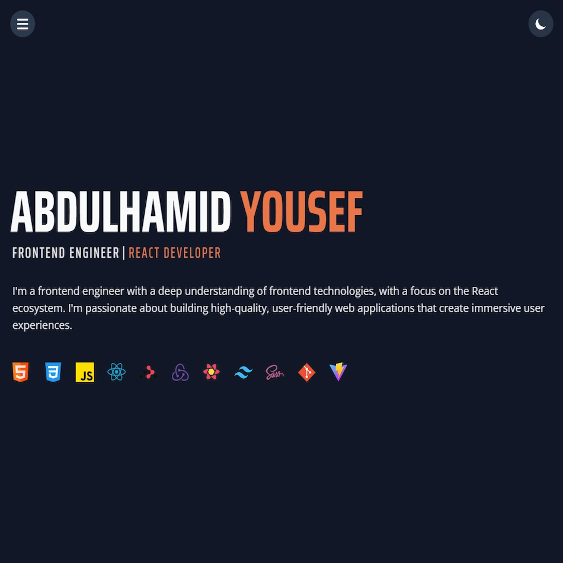

# My Portfolio

Welcome to my portfolio! This project showcases my skills using React, Tailwind, ESLint, and Vite. It includes a brief introduction about me, my projects, the technologies I've worked with, and my experience. You'll also find a contact form at the bottom and my social media links below it. Feel free to explore and connect with me!

<div align="center">
  <br>
  <a href="https://abdelhamid99.netlify.app/" target="_blank">
    
  </a>
  <br>
</div>

<p align="center" >
  <a href="#technologies">Technologies</a> •
  <a href="#how-to-use">How To Use</a> •
  <a href="#contact">Contact</a>   
</p>
<p align="center" >
  <a href="https://abdelhamid99.netlify.app/" target="_blank">Visit DEMO</a> 
</p>

## Technologies

- React
- Tailwindcss
- Vite
- EsLint
- Other libraries:
  - Framer Motion
  - Email JS
  - React Hot Toast
 
---
 
## How To Use

To clone and run this application, you'll need [Git](https://git-scm.com), [Node.js](https://nodejs.org/en) and [Vite](https://vitejs.dev/) installed on your computer. From your command line:

```bash
# Clone this repository
$ git clone https://github.com/bl33h/whosbl33h

# Install dependencies
$ npm i

# Run the app
$ npm run dev
```

---

## Contact

- [abdelhamedy33@gmail.com](mailto:abdelhamedy33@gmail.com)
- [LinkedIn](https://www.linkedin.com/in/abdulhamidyousef/)
<!-- - [Personal Website](https://abdelhamid99.netlify.app/) -->
